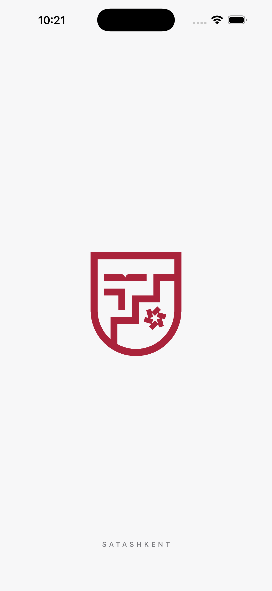
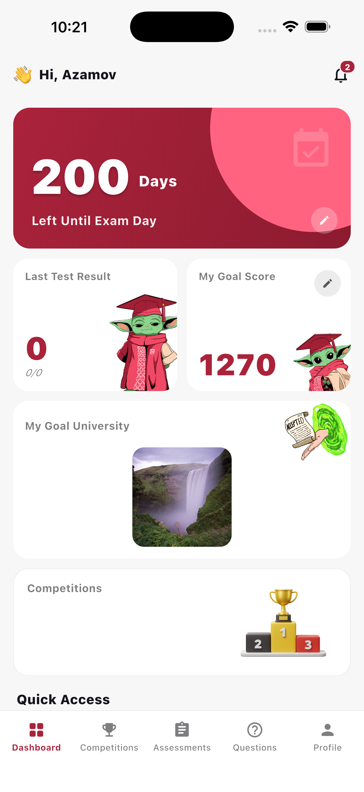
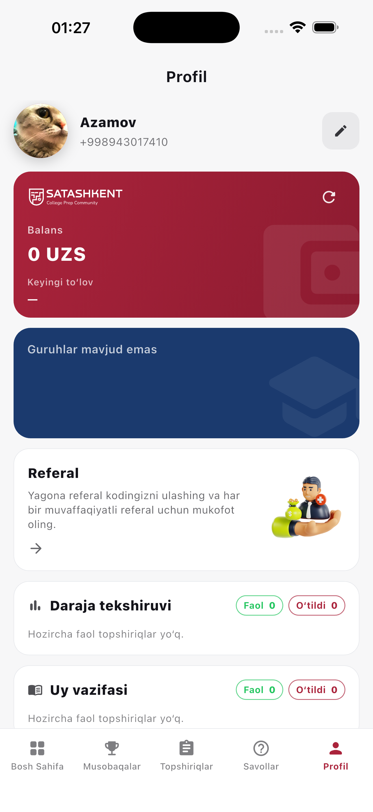
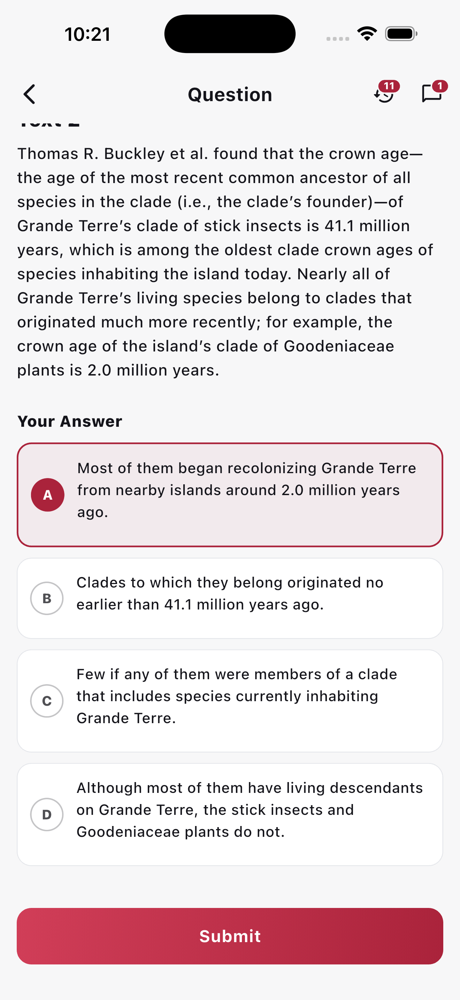
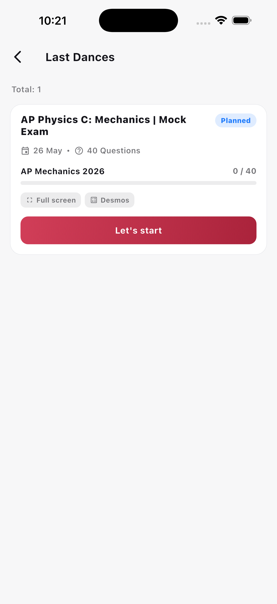
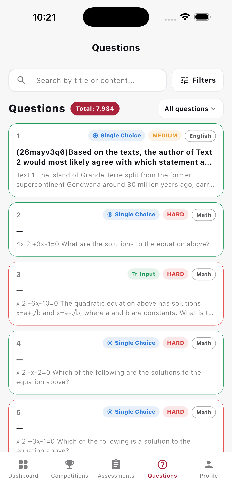

# SATASHKENT

<div align="center">

[](https://flutter.dev)
[](https://dart.dev)
[]()
[]()

</div>

## Screenshots

<div align="center">

|                    Splash                     |                   Dashboard                   |                    Profile                    |
|:---------------------------------------------:|:---------------------------------------------:|:---------------------------------------------:|
|  |  |  |

| Question Detail | Assessments | Questions |
|:---------------:|:-----------:|:---------:|
|  |  |  |

</div>

---

## Architecture

```
lib/
├── core/                 
│   ├── constants/        
│   ├── di/               
│   ├── error/          
│   ├── network/          
│   ├── router/          
│   ├── storage/           
│   ├── theme/             
│   └── widgets/           
└── features/              
    ├── auth/              
    ├── home/              
    ├── competitions/
    ├── assessments/      
    ├── questions/         
    ├── profile/           
    ├── notifications/
    ├── referral/
    ├── language/
    ├── splash/
    └── main_shell/       
```